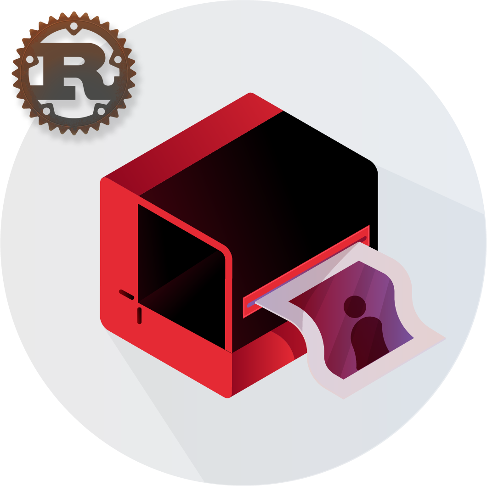

# darkroom-rs - Yet Another Image Proxy

[![tests][test-workflow-badge]][test-workflow]
[![codecov][coverage-badge]][codecov]

> A Rust re-write of original [`Darkroom`](https://github.com/gojek/darkroom).

## Introduction

`darkroom-rs` acts as an `Image Proxy` on your image source.
You may implement your own [`Processor`](src/processor/mod.rs#L11) and [`Storage`](src/storage/getter.rs#L6) interfaces
to gain custom functionality while still keeping other Darkroom Server functionality.  
The native implementations focus on simplicity.

## Features

Darkroom supports several image operations which are
documented [here](https://gojek.github.io/darkroom/docs/usage/size).

## Installation

TBD

---

[test-workflow-badge]: https://github.com/ajatprabha/darkroom-rs/workflows/Test/badge.svg

[test-workflow]: https://github.com/ajatprabha/darkroom-rs/actions?query=workflow%3Atest

[coverage-badge]: https://codecov.io/gh/ajatprabha/darkroom-rs/branch/main/graph/badge.svg?token=otSos8ZvrJ

[codecov]: https://codecov.io/gh/ajatprabha/darkroom-rs
