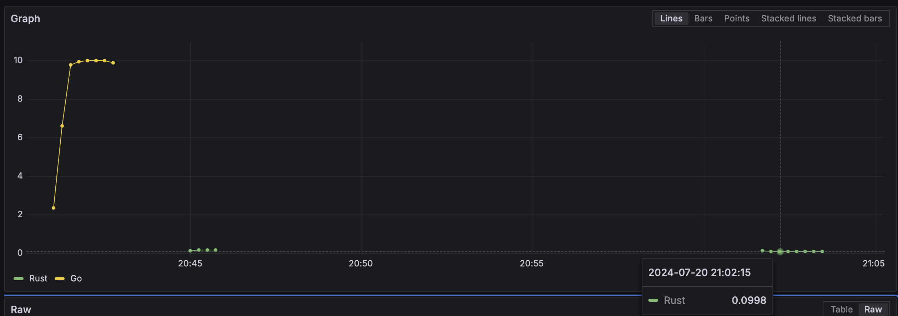
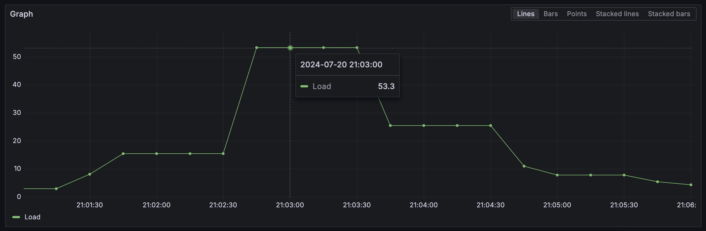
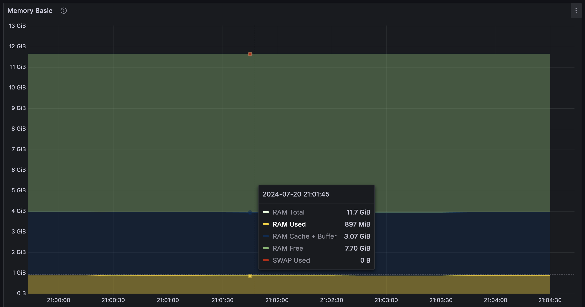
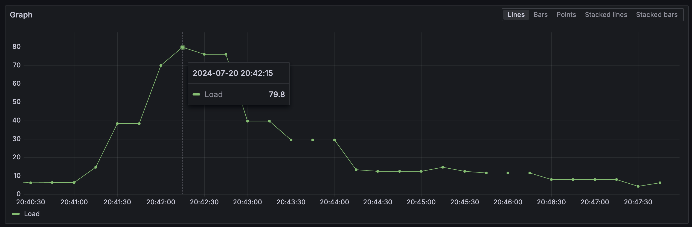
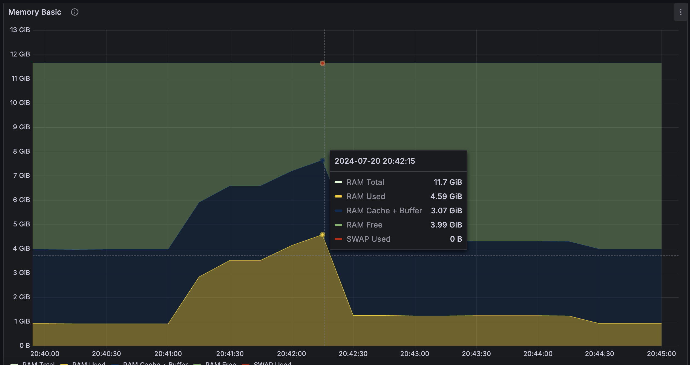

# Setup

On Mac, colima can be used to run docker and then docker-compose spins up everything.

To export node metrics, follow these steps:

```shell
wget https://github.com/prometheus/node_exporter/releases/download/v1.8.2/node_exporter-1.8.2.linux-amd64.tar.gz
tar xvfz node_exporter-1.8.2.linux-amd64.tar.gz
sudo cp node_exporter-1.8.2.linux-amd64/node_exporter /usr/local/bin/
sudo useradd --no-create-home --shell /bin/false node_exporter
sudo chown node_exporter:node_exporter /usr/local/bin/node_exporter
sudo chmod 755 /usr/local/bin/node_exporter
sudo systemctl daemon-reload
sudo systemctl start node_exporter
sudo systemctl enable node_exporter
sudo systemctl status node_exporter

sudo apt install vim
```

```shell
sudo vim /etc/systemd/system/node_exporter.service
```

```
[Unit]
Description=Node Exporter
Wants=network-online.target
After=network-online.target

[Service]
User=node_exporter
Group=node_exporter
Type=simple
ExecStart=/usr/local/bin/node_exporter

[Install]
WantedBy=multi-user.target
```

```shell
sudo vim /usr/local/bin/push_metrics.sh
```

```shell
#!/bin/bash

# Endpoint for Node Exporter metrics
NODE_EXPORTER_URL="http://localhost:9100/metrics"

# Endpoint for Pushgateway
PUSHGATEWAY_URL="http://localhost:9091/metrics/job/host-stats"

# Fetch metrics from Node Exporter
metrics=$(curl -s $NODE_EXPORTER_URL)

# Push metrics to Pushgateway
echo "$metrics" | curl --data-binary @- $PUSHGATEWAY_URL
```

```shell
sudo chmod +x /usr/local/bin/push_metrics.sh
```

```shell
sudo vim /etc/systemd/system/push_metrics.service
```

```
[Unit]
Description=Push Node Exporter metrics to Pushgateway

[Service]
ExecStart=/usr/local/bin/push_metrics.sh
```

```shell
sudo vim /etc/systemd/system/push_metrics.timer
```

```
[Unit]
Description=Run push_metrics.sh every 5s

[Timer]
OnBootSec=5sec
OnUnitActiveSec=5sec
Unit=push_metrics.service

[Install]
WantedBy=timers.target
```

```shell
sudo systemctl daemon-reload
sudo systemctl start push_metrics.timer
sudo systemctl enable push_metrics.timer
sudo systemctl status push_metrics.timer
```

> In grafana, import dashboard ID: 1860

### Run Benchmark

```shell
brew install vegeta
```

```shell
echo 'GET http://localhost:3002/assets/images/gophers.jpg?fit=crop&w=1024&h=1024&crop=center&blur=4' | vegeta attack -duration=1m | tee results-go.bin | vegeta report -type='hist[0,20ms,50ms,100ms,200ms,500ms,1s,2s,5s,10s]'
```

```shell
echo 'GET http://localhost:3001/images/gophers.jpg?fit=crop&w=1024&h=1024&crop=center&blur=8' | vegeta attack -duration=5s | tee results-rs.bin | vegeta report -type='hist[0,20ms,50ms,100ms,200ms,500ms,1s,2s,5s,10s]' 
```

## Observations

In Rust app, memory hardly shot up! And it was more consistent with latencies as well.

Rust Performance:

```
Bucket           #    %       Histogram
[0s,     20ms]   25   10.00%  #######
[20ms,   50ms]   0    0.00%
[50ms,   100ms]  0    0.00%
[100ms,  200ms]  6    2.40%   #
[200ms,  500ms]  177  70.80%  #####################################################
[500ms,  1s]     42   16.80%  ############
[1s,     2s]     0    0.00%
[2s,     5s]     0    0.00%
[5s,     10s]    0    0.00%
[10s,    +Inf]   0    0.00%
```

Go Performance:

```
Bucket           #    %       Histogram
[0s,     20ms]   458  15.27%  ###########
[20ms,   50ms]   33   1.10%
[50ms,   100ms]  57   1.90%   #
[100ms,  200ms]  64   2.13%   #
[200ms,  500ms]  168  5.60%   ####
[500ms,  1s]     207  6.90%   #####
[1s,     2s]     327  10.90%  ########
[2s,     5s]     327  10.90%  ########
[5s,     10s]    549  18.30%  #############
[10s,    +Inf]   810  27.00%  ####################
```

Rust is very consistent, with almost 2/3rd requests completing in less than 500ms, and max latency not going beyond 1s.

Moreover, it absolutely destroyed Go even with CPU only operations.

> Note: These unit is in seconds.

<a href="./graphs/latencies.png"></a>

#### Resources Stats

> CPU is 1m load avg.

##### Rust

<div style="display: flex; justify-content: space-between;">
  <a href="./graphs/cpu-rust.png" style="width: 50%;"></a>
  <a href="./graphs/mem-rust.png" style="width: 50%;"></a>
</div>

##### Go

<div style="display: flex; justify-content: space-between;">
  <a href="./graphs/cpu-go.png" style="width: 50%;"></a>
  <a href="./graphs/mem-go.png" style="width: 50%;"></a>
</div>
